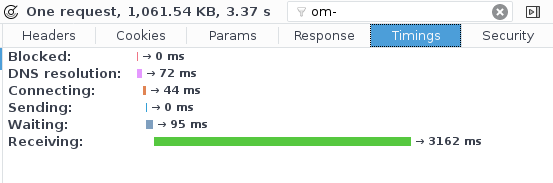

# The weight of JS generated by the Clojurescript compiler

Here we do production builds on different clojurescript examples to get a feel
for the kind of js payloads we'll end up with in real projects.

## Why?

Clojurescript compilation takes advantage of the Google Closure compiler to
build its generated JS. This allows for dead code elimination. Nevertheless, the
optimized payload seems to be important in non-trivial cases.

An extreme example of that is the front-end of [CircleCI]. The project has 26317
lines of cljs and 277 lines of clj (macros). The optimized js file served to the
browser weights 3.4M (1.02M gzipped). On the not so terrible internet connection
of my parents it takes more than 3 seconds to download.

[CircleCI]: https://github.com/circleci/frontend.

## Dependencies (only tested on linux!)

You will need to have boot and node (I needed `Math.log` for pretty printing
file sizes... Would not want to implement that in bash!).

## Results

Produced with `boot build` and then `scripts/report.sh`

| build                     |   JS | GZIP |
|---------------------------|------|------|
| empty.js                  |   5K |   2K |
| using-core-async.js       | 105K |  24K |
| using-clojure-spec.js     | 116K |  26K |
| using-client-routing.js   | 157K |  37K |
| one-rum-view.js           | 270K |  72K |
| using-websockets.js       | 480K | 116K |
| all-together.js           | 680K | 175K |
